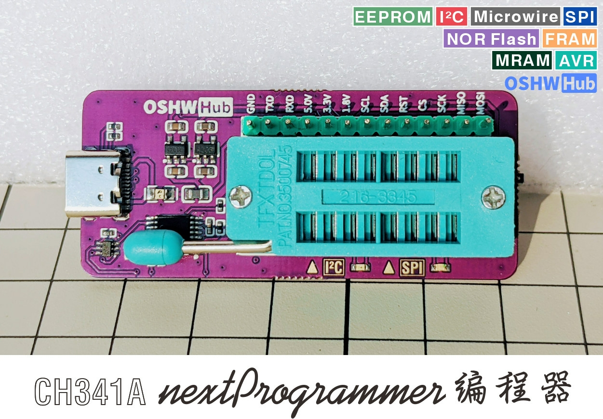

SNANDer
===

SNANDer - Serial Nor/nAND/Eeprom programmeR (based on CH341A)



**Requirements**

* gcc/mingw-w64, wget, make, and libusb-1.0-dev (via apt Command Line Tools)

**Compiling for Linux**

After installing the gcc and necessary tools, building `snander` is as simple as running the command:

```
make -C src/
```

After successful compilation, the target executable file will be generated in `src` folder.

Or you can choose static compile, building `snander` statically is as simple as running the command:

```
./build-for-linux.sh
```

After successful compilation, the target executable file will be generated in the `build` folder.

**Compiling for Windows**

After installing the mingw-w64 and necessary tools, building `snander` is as simple as running the included script:

```
./build-for-windows.sh
```

After successful compilation, the target executable file will be generated in the `build` folder, include x86 and x64 binaries.

**Compiling for MacOS**

After installing the necessary tools, building `snander` is as simple as running the included script:

```
./build-for-darwin.sh
```

After successful compilation, the target executable file will be generated in the `build` folder.

**Compiling for OpenWrt IPK**

First download `OpenWrt SDK` and extract it

```
    cd /path/to/your/sdk
    git clone https://github.com/Droid-MAX/SNANDer package/snander
    make menuconfig # Choose `snander` in section `Utilities`
    make package/snander/compile V=s
```

**Usage**

Using `snander` is straightforward:

```
SNANDer - Serial Nor/nAND/Eeprom programmeR v.1.7.8 by McMCC <mcmcc@mail.ru>

  Usage:
 -h             display this message
 -d             disable internal ECC(use read and write page size + OOB size)
 -o <bytes>     manual set OOB size with disable internal ECC(default 0)
 -I             ECC ignore errors(for read test only)
 -k             Skip BAD pages, try to read or write in next page
 -L             print list support chips
 -i             read the chip ID info
 -E             select I2C EEPROM {24c01|24c02|24c04|24c08|24c16|24c32|24c64|24c128|24c256|24c512|24c1024}
                select Microwire EEPROM {93c06|93c16|93c46|93c56|93c66|93c76|93c86|93c96} (need SPI-to-MW adapter)
                select SPI EEPROM 25xxx {25010|25020|25040|25080|25160|25320|25640|25128|25256|25512|251024}
 -8             set organization 8-bit for Microwire EEPROM(default 16-bit) and set jumper on SPI-to-MW adapter
 -f <addr len>  set manual address size in bits for Microwire EEPROM(default auto)
 -s <bytes>     set page size from datasheet for fast write SPI EEPROM(default not use)
 -e             erase chip(full or use with -a [-l])
 -l <bytes>     manually set length
 -a <address>   manually set address
 -w <filename>  write chip with data from filename
 -r <filename>  read chip and save data to filename
 -v             verify after write on chip
```

For example:

1. Get Flash info.

```
$ ./SNANDer -i

SNANDer - Serial Nor/nAND/Eeprom programmeR v.1.7.8 by McMCC <mcmcc@mail.ru>

Found programmer device: WinChipHead (WCH) - CH341A
Device revision is 3.0.4
spi device id: ff c2 22 c2 22 (c222c222)
SPI NOR Flash Not Detected!
spi_nand_probe: mfr_id = 0xc2, dev_id = 0x22
Get Status Register 1: 0x38
Get Status Register 2: 0x10
Using Flash ECC.
Detected SPI NAND Flash: MXIC MX35LF2GE4AB, Flash Size: 256 MB
$
```

2. Full erase flash with disable internal ECC check. Without OOB, page size 2112 bytes.

```
$ ./SNANDer -d -e

SNANDer - Serial Nor/nAND/Eeprom programmeR v.1.7.8 by McMCC <mcmcc@mail.ru>

Found programmer device: WinChipHead (WCH) - CH341A
Device revision is 3.0.4
spi device id: ff c2 22 c2 22 (c222c222)
SPI NOR Flash Not Detected!
spi_nand_probe: mfr_id = 0xc2, dev_id = 0x22
Get Status Register 1: 0x00
Get Status Register 2: 0x11
Disable Flash ECC.
Detected SPI NAND Flash: MXIC MX35LF2GE4AB, Flash Size: 256 MB
ERASE:
Set full erase chip!
Erase addr = 0x0000000000000000, len = 0x0000000010800000
Erase 100% [276824064] of [276824064] bytes
Elapsed time: 3 seconds
Status: OK
$
```

3. Write and verify flash with disable internal ECC check. Without OOB, page size 2112 bytes.

```
$ ./SNANDer -d -v -w ecc_2Gb_2K_64_flashimage_rfb1_ac2600.bin

SNANDer - Serial Nor/nAND/Eeprom programmeR v.1.7.8 by McMCC <mcmcc@mail.ru>

Found programmer device: WinChipHead (WCH) - CH341A
Device revision is 3.0.4
spi device id: ff c2 22 c2 22 (c222c222)
SPI NOR Flash Not Detected!
spi_nand_probe: mfr_id = 0xc2, dev_id = 0x22
Get Status Register 1: 0x00
Get Status Register 2: 0x11
Disable Flash ECC.
Detected SPI NAND Flash: MXIC MX35LF2GE4AB, Flash Size: 256 MB
WRITE:
Write addr = 0x0000000000000000, len = 0x000000000E5A9D6F
Written 100% [240819567] of [240819567] bytes
Elapsed time: 4184 seconds
Status: OK
VERIFY:
Read addr = 0x0000000000000000, len = 0x000000000E5A9D6F
Read 100% [240819567] of [240819567] bytes
Elapsed time: 2047 seconds
Status: OK
$
```

4. Read Microwire EEPROM Atmel 93C46 and save file.

```
$ ./SNANDer -E 93c46 -r test.bin

SNANDer - Serial Nor/nAND/Eeprom programmeR v.1.7.8 by McMCC <mcmcc@mail.ru>

Found programmer device: WinChipHead (WCH) - CH341A
Device revision is 3.0.4
Microwire EEPROM chip: 93c46, Size: 64 bytes, Org: 16 bits, fix addr len: Auto
READ:
Read addr = 0x0000000000000000, len = 0x0000000000000080
Read_EEPROM_3wire: Set address len 6 bits
Read 100% [64] of [64] bytes
Read [128] bytes from [93c46] EEPROM address 0x00000000
Elapsed time: 0 seconds
Status: OK
```

5. Write and verify Microwire EEPROM Atmel 93C46 from file.

```
$ ./SNANDer -E 93c46 -w test.bin -v

SNANDer - Serial Nor/nAND/Eeprom programmeR v.1.7.8 by McMCC <mcmcc@mail.ru>

Found programmer device: WinChipHead (WCH) - CH341A
Device revision is 3.0.4
Microwire EEPROM chip: 93c46, Size: 64 bytes, Org: 16 bits, fix addr len: Auto
WRITE:
Write addr = 0x0000000000000000, len = 0x0000000000000080
Erase_EEPROM_3wire: Set address len 6 bits
Write_EEPROM_3wire: Set address len 6 bits
Written 100% [64] of [64] bytes
Wrote [128] bytes to [93c46] EEPROM address 0x00000000
Elapsed time: 1 seconds
Status: OK
VERIFY:
Read addr = 0x0000000000000000, len = 0x0000000000000080
Read_EEPROM_3wire: Set address len 6 bits
Read 100% [64] of [64] bytes
Read [128] bytes from [93c46] EEPROM address 0x00000000
Elapsed time: 1 seconds
Status: OK
```

6. Write and verify SPI EEPROM Atmel AT25640B from file.

```
$ ./SNANDer -E 25640 -v -w test.bin

SNANDer - Serial Nor/nAND/Eeprom programmeR v.1.7.8 by McMCC <mcmcc_at_mail.ru>

Found programmer device: WinChipHead (WCH) - CH341A
Device revision is 3.0.4
SPI EEPROM chip: 25640, Size: 8192 bytes
WRITE:
Written addr = 0x0000000000000000, len = 0x0000000000002000
Wrote 100% [8192] bytes to [25640] EEPROM address 0x00000000
Elapsed time: 22 seconds
Status: OK
VERIFY:
Read addr = 0x0000000000000000, len = 0x0000000000002000
Read 100% [8192] bytes from [25640] EEPROM address 0x00000000
Elapsed time: 2 seconds
Status: OK
```

7. Fast write and verify SPI EEPROM Atmel AT25640B from file with use page size.
   (Find out page size from datasheet on chip!!!)

```
$ ./SNANDer -E 25640 -v -w test.bin -s 32

SNANDer - Serial Nor/nAND/Eeprom programmeR v.1.7.8 by McMCC <mcmcc_at_mail.ru>

Found programmer device: WinChipHead (WCH) - CH341A
Device revision is 3.0.4
SPI EEPROM chip: 25640, Size: 8192 bytes
Setting page size 32B for write.
WRITE:
Write addr = 0x0000000000000000, len = 0x0000000000002000
Written 100% [8192] bytes to [25640] EEPROM address 0x00000000
Elapsed time: 1 seconds
Status: OK
VERIFY:
Read addr = 0x0000000000000000, len = 0x0000000000002000
Read 100% [8192] bytes from [25640] EEPROM address 0x00000000
Elapsed time: 2 seconds
Status: OK
```

**Supported Chips**

```
SPI NAND Flash Support List:
001. GIGADEVICE GD5F1GQ4UA
002. GIGADEVICE GD5F1GQ4UB
003. GIGADEVICE GD5F1GQ4UC
004. GIGADEVICE GD5F1GQ4UE
005. GIGADEVICE GD5F1GQ5UE
006. GIGADEVICE GD5F1GQ5RE
007. GIGADEVICE GD5F2GQ5UE
008. GIGADEVICE GD5F2GQ5RE
009. GIGADEVICE GD5F2GQ4UB
010. GIGADEVICE GD5F2GQ4UE
011. GIGADEVICE GD5F2GQ4UC
012. GIGADEVICE GD5F4GQ4UB
013. GIGADEVICE GD5F4GQ4UC
014. ESMT F50D1G41LB(2M)
015. ESMT F50L512
016. ESMT F50L1G
017. ESMT F50L1G41LB
018. ESMT F50L2G41LB
019. WINBOND W25N01GV
020. WINBOND W25N01GW
021. WINBOND W25N02KV
022. WINBOND W25M02GV
023. MXIC MX35LF1GE4AB
024. MXIC MX35LF2GE4AB
025. MXIC MX35LF2G14AC
026. MXIC MX35LF2GE4AD
027. ZENTEL A5U12A21ASC
028. ZENTEL A5U1GA21BWS
029. ETRON EM73C044SNB
030. ETRON EM73C044SND
031. ETRON EM73C044SNF
032. ETRON EM73C044VCA
033. ETRON EM73C044VCD
034. ETRON EM73D044VCA
035. ETRON EM73D044VCB
036. ETRON EM73D044VCD
037. ETRON EM73D044VCG
038. ETRON EM73D044VCH
039. ETRON EM73D044SNA
040. ETRON EM73D044SNC
041. ETRON EM73D044SND
042. ETRON EM73D044SNF
043. ETRON EM73E044SNA
044. TOSHIBA TC58CVG0S3H
045. TOSHIBA TC58CVG1S3H
046. TOSHIBA TC58CVG2S0H
047. KIOXIA TC58CVG2S0HRAIJ
048. MICRON MT29F1G01
049. MICRON MT29F2G01
050. MICRON MT29F4G01
051. HEYANG HYF1GQ4UAACAE
052. HEYANG HYF2GQ4UAACAE
053. HEYANG HYF2GQ4UHCCAE
054. HEYANG HYF1GQ4UDACAE
055. HEYANG HYF2GQ4UDACAE
056. PN PN26G01A-X
057. PN PN26G02A-X
058. PN PN26Q01A-X
059. ATO ATO25D1GA
060. ATO ATO25D2GA
061. ATO ATO25D2GB
062. FM FM25S01
063. FM FM25S01A
064. FM FM25G01B
065. FM FM25G02B
066. FM FM25G02C
067. FM FM25G02
068. XTX XT26G02B
069. XTX XT26G01C
070. XTX XT26G02C
071. XTX XT26G01A
072. XTX XT26G02A
073. XTX XT26G02E
074. MIRA PSU1GS20BN
075. BIWIN BWJX08U
076. BIWIN BWET08U
077. FORESEE FS35ND01GD1F1
078. FORESEE FS35ND01GS1F1
079. FORESEE FS35ND02GS2F1
080. FORESEE FS35ND02GD1F1
081. FORESEE FS35ND01GS1Y2
082. FORESEE FS35ND02G-S3Y2
083. FORESEE FS35ND04G-S2Y2
084. DS DS35Q2GA
085. DS DS35M2GA
086. DS DS35Q1GA
087. DS DS35M1GA
088. FISON CS11G0T0A0AA
089. FISON CS11G1T0A0AA
090. FISON CS11G0G0A0AA
091. TYM TYM25D2GA01
092. TYM TYM25D2GA02
093. TYM TYM25D1GA03
094. XINCUN XCSP1AAWH-NT

SPI NOR Flash Support List:
001. AT26DF161
002. AT25DF321
003. A25L10PU
004. A25L20PU
005. A25L040
006. A25LQ080
007. A25L080
008. A25LQ16
009. A25LQ32
010. A25L032
011. A25LQ64
012. ES25P10
013. ES25P20
014. ES25P40
015. ES25P80
016. ES25P16
017. ES25P32
018. ES25M40A
019. ES25M80A
020. ES25M16A
021. DQ25Q64AS
022. F25L016
023. F25L16QA
024. F25L032
025. F25L32QA
026. F25L064
027. F25L64QA
028. GD25Q20C
029. GD25Q40C
030. GD25Q80C
031. GD25LQ80C
032. GD25WD80C
033. GD25WQ80E
034. GD25Q16
035. GD25LQ16C
036. GD25WQ16E
037. GD25Q32
038. GD25LQ32E
039. GD25WQ32E
040. GD25Q64CSIG
041. GD25Q128CSIG
042. GD25F256F
043. GD25Q256CSIG
044. MX25L4005A
045. MX25L8005M
046. MX25L1605D
047. MX25L3205D
048. MX25L6405D
049. MX25L12805D
050. MX25L25635E
051. MX25L51245G
052. YC25Q128
053. FL016AIF
054. FL064AIF
055. S25FL016P
056. S25FL032P
057. S25FL064P
058. S25FL128P
059. S25FL129P
060. S25FL256S
061. S25FL512S
062. S25FL116K
063. S25FL132K
064. S25FL164K
065. EN25F16
066. EN25Q16
067. EN25QH16
068. EN25Q32B
069. EN25F32
070. EN25F64
071. EN25Q64
072. EN25QA64A
073. EN25QH64A
074. EN25Q128
075. EN25Q256
076. EN25QA128A
077. EN25QH128A
078. GM25Q128A
079. W25X05
080. W25X10
081. W25X20
082. W25X40
083. W25X80
084. W25X16
085. W25X32VS
086. W25X64
087. W25Q20CL
088. W25Q20BW
089. W25Q20EW
090. W25Q80
091. W25Q80BL
092. W25Q16JQ
093. W25Q16JM
094. W25Q32BV
095. W25Q32DW
096. W25Q32JWIM
097. W25Q64BV
098. W25Q64DW
099. W25Q64JVIM
100. W25Q128BV
101. W25Q128FW
102. W25Q256FV
103. W25Q256JW
104. W25Q256JWIM
105. W25Q512JV
106. W25Q512JVIM
107. W25Q512NW
108. W25Q512NWIM
109. M25P05
110. M25P10
111. M25P20
112. M25P40
113. M25P80
114. M25P16
115. M25P32
116. M25P64
117. M25P128
118. N25Q016A
119. N25Q032A
120. N25Q032A
121. N25Q064A
122. N25Q064A
123. N25Q128A
124. N25Q128A
125. N25Q256A
126. N25Q512A
127. MT25QL64AB
128. MT25QU64AB
129. MT25QL128AB
130. MT25QU128AB
131. MT25QL256AB
132. MT25QU256AB
133. MT25QL512AB
134. MT25QU512AB
135. XM25QH10B
136. XM25QH20B
137. XM25QU41B
138. XM25QH40B
139. XM25QU80B
140. XM25QH80B
141. XM25QU16B
142. XM25QH16C
143. XM25QW16C
144. XM25QH32B
145. XM25QW32C
146. XM25LU32C
147. XM25QH32A
148. XM25QH64C
149. XM25LU64C
150. XM25QW64C
151. XM25QH64A
152. XM25QH128A
153. XM25QH128C
154. XM25LU128C
155. XM25QW128C
156. XM25QH256C
157. XM25QU256C
158. XM25QW256C
159. XM25QH512C
160. XM25QU512C
161. XM25QW512C
162. MD25D20
163. MD25D40
164. ZB25VQ16
165. ZB25LQ16
166. ZB25VQ32
167. ZB25LQ32
168. ZB25VQ64
169. ZB25LQ64
170. ZB25VQ128
171. ZB25LQ128
172. LE25U20AMB
173. LE25U40CMC
174. BY25D05AS
175. BY25D10AS
176. BY25D20AS
177. BY25D40AS
178. BY25Q40BL
179. BY25Q40BL
180. BY25Q80BS
181. BY25Q16BS
182. BY25Q16BL
183. BY25Q32BS
184. BY25Q32AL
185. BY25Q64AS
186. BY25Q64AL
187. BY25Q128AS
188. BY25Q128EL
189. BY25Q256ES
190. XT25F04D
191. XT25F08B
192. XT25F08D
193. XT25F16B
194. XT25Q16D
195. XT25F32B
196. XT25F64B
197. XT25Q64D
198. XT25F128B
199. XT25F128D
200. PM25LQ016
201. PM25LQ032
202. PM25LQ064
203. PM25LQ128
204. IS25LQ010
205. IS25LQ020
206. IS25WP040D
207. IS25LP080D
208. IS25WP080D
209. IS25LP016D
210. IS25WP016D
211. IS25LP032D
212. IS25WP032D
213. IS25LP064D
214. IS25WP064D
215. IS25LP128F
216. IS25WP128F
217. IS25LP256D
218. IS25WP256D
219. IS25LP256D
220. IS25WP256D
221. FM25W04
222. FM25Q04
223. FM25Q08
224. FM25W16
225. FM25Q16
226. FM25W32
227. FS25Q32
228. FM25W64
229. FS25Q64
230. FM25W128
231. FS25Q128
232. FM25Q04A
233. FM25M04A
234. FM25Q08A
235. FM25M08A
236. FM25Q16A
237. FM25M16A
238. FM25Q32A
239. FM25M32B
240. FM25Q64A
241. FM25M64A
242. FM25Q128A
243. PN25F16
244. PN25F32
245. PN25F64
246. PN25F128
247. P25D05H
248. P25D10H
249. P25D20H
250. P25D40H
251. P25D80H
252. P25Q16H
253. P25Q32H
254. P25Q64H
255. P25Q128H
256. PY25Q128HA
257. SK25P32
258. SK25P64
259. SK25P128
260. ZD25Q16A
261. ZD25Q32A
262. ZD25Q64A
263. ZD25Q128A
264. ZD25Q16B
265. ZD25Q32B
266. ZD25Q64B
267. ZD25Q128B
268. PCT25VF010A
269. PCT25VF020B
270. PCT25VF040B
271. PCT25VF080B
272. PCT25VF016B
273. PCT25VF032B
274. PCT25VF064C
275. PCT26VF016
276. PCT26VF032

I2C EEPROM Support List:
001. 24c01
002. 24c02
003. 24c04
004. 24c08
005. 24c16
006. 24c32
007. 24c64
008. 24c128
009. 24c256
010. 24c512
011. 24c1024

Microwire EEPROM Support List:
001. 93c06
002. 93c16
003. 93c46
004. 93c56
005. 93c66
006. 93c76
007. 93c86
008. 93c96

SPI EEPROM Support List:
001. 25010
002. 25020
003. 25040
004. 25080
005. 25160
006. 25320
007. 25640
008. 25128
009. 25256
010. 25512
011. 251024
```

**Author**

Originally written by [McMCC](https://github.com/McMCCRU/SNANDer) and released under the terms of the GNU GPL, version 2.0, or later. Modifications by [Droid-MAX](https://github.com/Droid-MAX/) to make it more easier build for Windows.

**License**

This is free software: you can redistribute it and/or modify it under the terms of
the latest GNU General Public License as published by the Free Software Foundation.

This program is distributed in the hope that it will be useful, but WITHOUT ANY WARRANTY;
without even the implied warranty of MERCHANTABILITY or FITNESS FOR A PARTICULAR PURPOSE.
See the GNU General Public License for more details.

You should have received a copy of the GNU General Public License along with this program.
If not, see <http://www.gnu.org/licenses/>.
